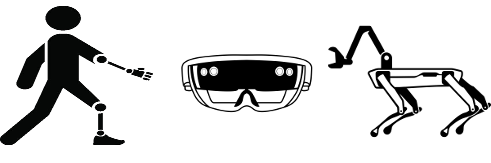
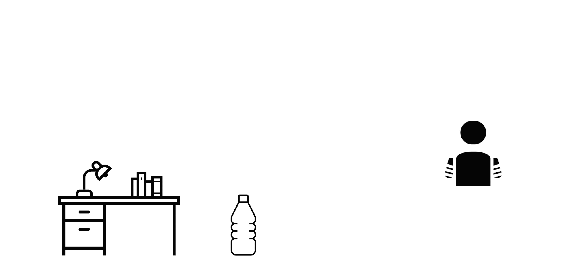
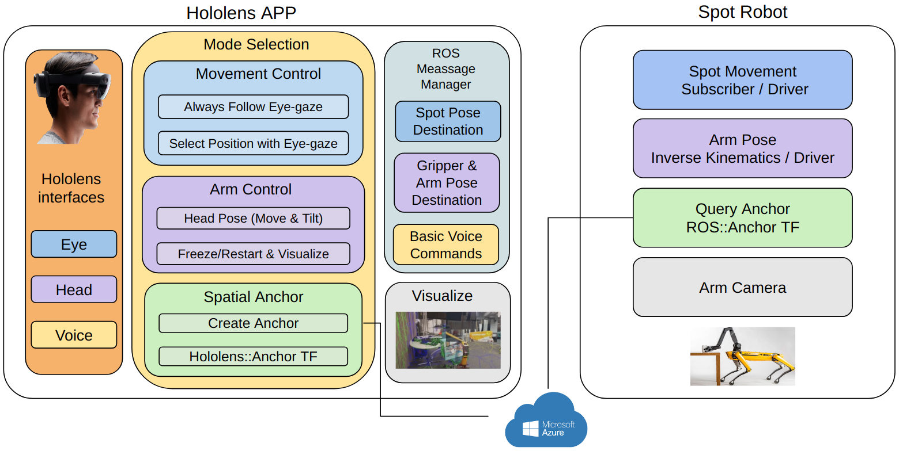

# HoloSpot: Accessible robot control in Mixed Reality



## Demo

Here is a demostration of follow mode in our project:

<video src="Assets/holospot.mp4"></video>

For other modes, please see our [project website](https://zhangganlin.github.io/Holo-Spot-Page/index.html).

## Overview

Course project of Mixed Reality Fall 2022 in ETHZ.



A HoloLens 2 application that enables users (especially amputy people) to control the Boston Dynamics Spot robot’s movement and arm using:

- Eye tracking.
- Head movements.
- Voice control. 

We implements three control modes, including follow mode (robot follow eye gaze), select mode (robot directly goes to the selected location), and arm mode (robot arm mimic the user’s head pose). Besides, we also implements user friendly interface including voice control,  arm camera visualization, and a help panel to show detailed command for the users. 

More details about this project can be found in our [project website](https://zhangganlin.github.io/Holo-Spot-Page/index.html) and [report](
report/report.pdf).

Authors: [Ganlin Zhang*](https://github.com/zhangganlin), [Deheng Zhang *](), [Longteng Duan *](https://github.com/DecAd3), [Guo Han *](https://github.com/guo-han)

(\* Equally contribute to this project)


## System Overview



## Set Up

Requirements: 

* Windows for the unity application, Ubuntu 20.04 & ROS Noetic for the spot robot. 
* The Unity version is really important (recommend [`2020.3.40`](https://unity.com/releases/editor/whats-new/2020.3.40) )
* 

Clone this repository:

```shell
git clone https://github.com/dehezhang2/holo-spot.git
```

### Spot Robot Connection

1. Connecting the robot using ssh. 
2. Follow the instruction in [ROS_ws](https://github.com/dehezhang2/holo-spot/blob/master/ROS_ws/README.md).

### Unity App Deployment

1. Open this project using Unity

2. In the unity project `File > Build Settings > Universal Windows Platform`, use the following settings:

   ```
   Target Device: Hololens 
   Architecture: ARM64
   ```

   Then click `Switch Platform`.

   

3. Switch the anchor user information in `Assets>Scenes>SampleScene`, edit the game object `AzureSpatialAnchors`, fill the `Spatial Anchors Account id`, `Spatial Anchors Account` and `Spatial Anchors Account Domain` in Credentials.

   

* **Please don’t move the project folder once you create it!!**
* You can refer to the [MRTK Tutorial](https://learn.microsoft.com/en-us/training/modules/learn-mrtk-tutorials/1-1-introduction) to build and deploy the project.
   * Make sure the unity version is consist. 
   * Connecting the Hololens2 to the USB can make the deployment faster.

## Acknowledgement

We thank our supervisor [**Eric Vollenweider**](https://www.google.com/url?q=https%3A%2F%2Fwww.linkedin.com%2Fin%2Feric-vollenweider-1b4b1616a%2F&sa=D&sntz=1&usg=AOvVaw17gr9GUNJvSQ1Z8q3tNMfJ) from [Microsoft Mixed Reality & AI Lab Zurich](https://www.google.com/url?q=https%3A%2F%2Fwww.microsoft.com%2Fen-us%2Fresearch%2Flab%2Fmixed-reality-ai-zurich%2F&sa=D&sntz=1&usg=AOvVaw0Kr16B1OhJ7Ac4DE_GRBcG) for the help and tons of useful advice for this project.

We also thank [**Boyang Sun**](https://www.google.com/url?q=https%3A%2F%2Fwww.linkedin.com%2Fin%2Fboyang-sun-8a1624117&sa=D&sntz=1&usg=AOvVaw0uGa6-eacTqtFZvf-OpCBZ) for the support for the usage of the Spot robot from [CVG lab in ETH Zurich](https://www.google.com/url?q=https%3A%2F%2Fwww.cvg.ethz.ch%2F&sa=D&sntz=1&usg=AOvVaw1dDhOuYfYGJ0L_aogn7TgC).

## License
